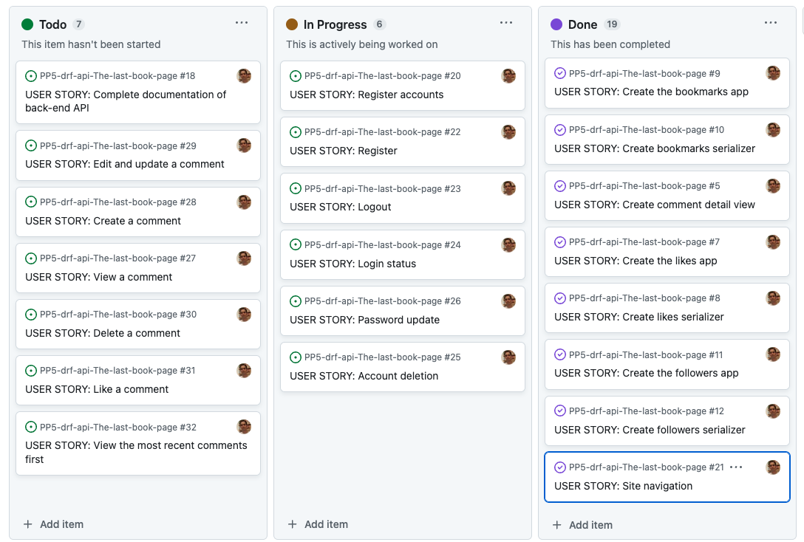
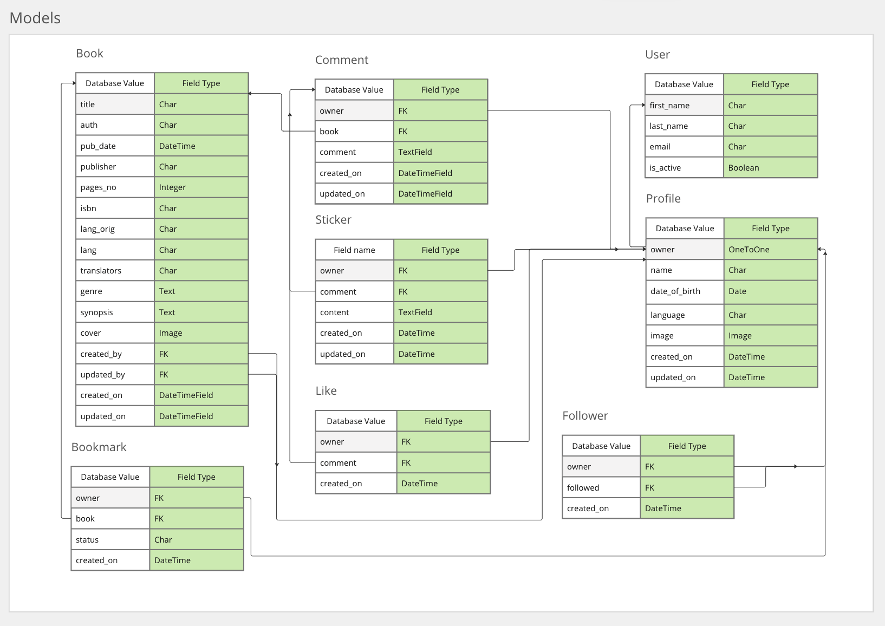
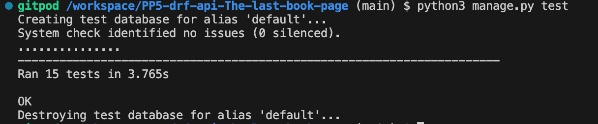
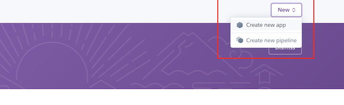
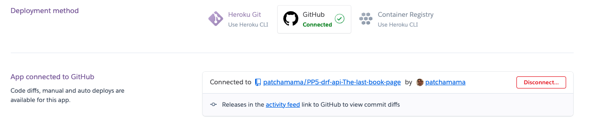
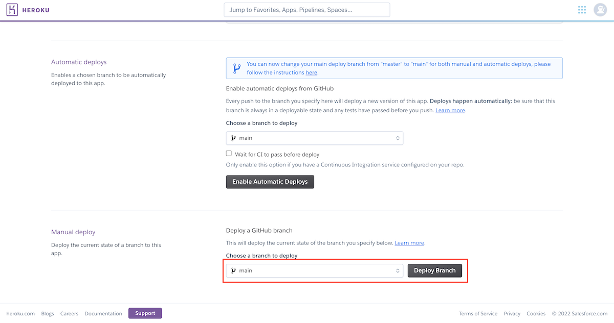
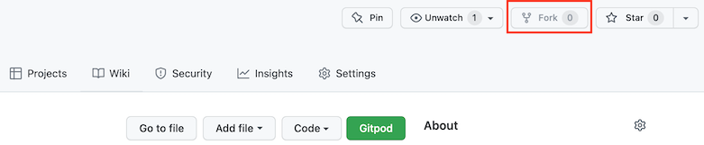

# **_The last book page - Django REST Framework API_**


This repository is the back-end **REST API** which is used by my front-end project - [The last book page](README.md)

You can view the live site [**here**](https://drp-api-the-last-book-page-4bcf6d1799b5.herokuapp.com/)

You can view the front-end _README.md_ [**here**](README.md)

# Objective

The reason for this API is to provide all the information required for querying and updating data from the front-end "The last book page". To do this using the (MVC) pattern, this application manages the model and controller that serve the data required by the front-end (the View managed with React). To meet its objectives, exhaustive tests are carried out to validate the correct manipulation of data and limited and secure access to the data, depending on the pre-established permissions in the application, taking care of security.

# Table of contents

- [**_The last book page - Django REST Framework API_**](#---the-last-book-page---django-rest-framework-api---)
- [Objective](#objective)
- [User Experience (UX)](#user-experience--ux-)
  - [Backend Django REST API](#backend-django-rest-api)
  - [Frontend React](#frontend-react)
- [Agile Methodology](#agile-methodology)
- [Entity Relationship Diagram](#entity-relationship-diagram)
- [Database](#database)
- [Models](#models)
- [Testing](#testing)
- [Technologies Used](#technologies-used)
- [Development](#development)
- [Deployment](#deployment)
- [Credits](#credits)
- [Acknowledgments](#acknowledgments)

<small><i><a href='http://ecotrust-canada.github.io/markdown-toc/'>Table of contents generated with markdown-toc</a></i></small>

# User Experience (UX)

### User Stories

In total 48 User Stories have been created and executed in 15 Epics (Milestones). In the backend 20 User Stories with 8 Epics, and in the Frontend 26 User Stories with 7 Epics (2 User Stories are pending).
Epic 11 was added in the backend while the frontend was being developed to add the option to insert stickers in comments and have the API provide that information. Search fields were sometimes added in the backend to meet the frontend's wishes for search and display information. In the commit history you can see how the tasks were executed as the development of the application progressed.

## Backend Django REST API

### Epic#1

[#1](https://github.com/patchamama/PP5-drf-api-The-last-book-page/issues/1) As a **Developer**, I can **create and develop the profiles app** so that **the users can create their own profiles**

[#2](https://github.com/patchamama/PP5-drf-api-The-last-book-page/issues/2) As a **Developer**, I can **serialize the profiles app** so that **the data can be used as python native datatype and can be render to JSON**

[#15](https://github.com/patchamama/PP5-drf-api-The-last-book-page/issues/15) As a **Developer**, I can **, I can install Django with its dependencies** so that ** can be created the project and apps to develop**

### Epic#2

[#13](https://github.com/patchamama/PP5-drf-api-The-last-book-page/issues/13) As a **Developer**, I can **Install and develop the books app** so that **users can create their own books**

[#14](https://github.com/patchamama/PP5-drf-api-The-last-book-page/issues/14) As a **Developer**, I can **serialize the books app** so that **the data can be used as python native datatype and can be render to JSON**

### Epic#3

[#3](https://github.com/patchamama/PP5-drf-api-The-last-book-page/issues/3) As a **Developer**, I can **Install and develop the comments app** so that **users can create their own comments**

[#4](https://github.com/patchamama/PP5-drf-api-The-last-book-page/issues/4) As a **Developer**, I can **serialize the comments app** so that **the data can be used as python native datatype and can be render to JSON**

[#5](https://github.com/patchamama/PP5-drf-api-The-last-book-page/issues/5) As a **Developer**, I can **develop the comment detail view** so that **the user can develop Read, Update, Delete and retrieve data of comments**

[#6](https://github.com/patchamama/PP5-drf-api-The-last-book-page/issues/6) As a **Developer**, I can **serialize the comments detail app** so that **the data can be used as python native datatype and can be render to JSON**

### Epic#4

[#7](https://github.com/patchamama/PP5-drf-api-The-last-book-page/issues/7) As a **Developer**, I can **Install and develop the likes app** so that **users can create their own likes**

[#8](https://github.com/patchamama/PP5-drf-api-The-last-book-page/issues/8) As a **Developer**, I can **serialize the likes app** so that **the data can be used as python native datatype and can be render to JSON**

### Epic#5

[#11](https://github.com/patchamama/PP5-drf-api-The-last-book-page/issues/11) As a **Developer**, I can **Install and develop the followers app** so that **users can create their own followers**

[#12](https://github.com/patchamama/PP5-drf-api-The-last-book-page/issues/12) As a **Developer**, I can **serialize the followers app** so that **the data can be used as python native datatype and can be render to JSON**

### Epic#6

[#9](https://github.com/patchamama/PP5-drf-api-The-last-book-page/issues/9) As a **Developer**, I can **Install and develop the bookmarks app** so that **users can create their own bookmarks**

[#10](https://github.com/patchamama/PP5-drf-api-The-last-book-page/issues/10) As a **Developer**, I can **serialize the bookmarks app** so that **the data can be used as python native datatype and can be render to JSON**

### Epic#7

[#16](https://github.com/patchamama/PP5-drf-api-The-last-book-page/issues/16) As a **Developer**, I can **optimize, document and fix bugs** so that **users can use the API with the expected functionalities**

[#17](https://github.com/patchamama/PP5-drf-api-The-last-book-page/issues/17) As a **Developer**, I can **create filters** so that **users can access as much useful data as the API can provide**

[#19](https://github.com/patchamama/PP5-drf-api-The-last-book-page/issues/19) As a **Developer**, I can **program tests to evaluate the behaviour of the api** so that **users can get the expected functionalities**

### Epic#11

[#36](https://github.com/patchamama/PP5-drf-api-The-last-book-page/issues/36) - As a **Developer**, I can **Install and develop the stickers app** so that **users can add notes to comments of books**

[#37](https://github.com/patchamama/PP5-drf-api-The-last-book-page/issues/37) As a **Developer**, I can **serialize the stickers app** so that **the data can be used as python native datatype and can be render to JSON**

## Frontend React

### Epic#8

[#20](https://github.com/patchamama/PP5-drf-api-The-last-book-page/issues/20) As a **User**, I can **register an account** so that **, I can access to the features available to registered users**

[#21](https://github.com/patchamama/PP5-drf-api-The-last-book-page/issues/21) As a **User**, I can **access to a navigation bar on every page** so that **, I can easily view and access to desired content**

[#22](https://github.com/patchamama/PP5-drf-api-The-last-book-page/issues/22) As a **User**, I can **register for an account** so that **, I can access to information dedicated to registered users**

[#23](https://github.com/patchamama/PP5-drf-api-The-last-book-page/issues/23) As a **User**, I can **log out** so that **, I can safely disconnect from the site**

[#24](https://github.com/patchamama/PP5-drf-api-The-last-book-page/issues/24) As a **logged-in User**, I can **see my login status** so that **I know my status of logged in or logged out of my account**

### Epic#9

[#27](https://github.com/patchamama/PP5-drf-api-The-last-book-page/issues/27) As a **User**, I can **view the complete comments** so that **, I can access and read the comments of the app**

[#28](https://github.com/patchamama/PP5-drf-api-The-last-book-page/issues/28) As a **logged-in User**, I can **create comments** so that **, I can add content to the website**

[#31](https://github.com/patchamama/PP5-drf-api-The-last-book-page/issues/31) As a **logged-in User**, I can **like a comment** so that **, I can show my approval and interest in the commentary**

[#32](https://github.com/patchamama/PP5-drf-api-The-last-book-page/issues/32) As a **User**, I can **see the newest comments at the top** so that **I am up to date with the latest content**

### Epic#10

[#29](https://github.com/patchamama/PP5-drf-api-The-last-book-page/issues/29) As a **logged-in User**, I can **edit my comments** so that **, I can update and do corrections of my contents added**

[#30](https://github.com/patchamama/PP5-drf-api-The-last-book-page/issues/30) As a **logged-in User**, I can **delete my comments** so that **, I can remove any comment that I don't want to share more**

[#33](https://github.com/patchamama/PP5-drf-api-The-last-book-page/issues/33) As a **User**, I can **keep scrolling through the images that are loaded automatically** so that **I visit all the browse easy all the content**

[#34](https://github.com/patchamama/PP5-drf-api-The-last-book-page/issues/34) As User**, I can **search the content easily** so that **, I can find with simplicity any wished information\*\*

### Epic#12

[#38](https://github.com/patchamama/PP5-drf-api-The-last-book-page/issues/38) As a **User**, I can **view stickers on comments** so that **, I can read other user**

[#40](https://github.com/patchamama/PP5-drf-api-The-last-book-page/issues/40) As a **logged-in User and owner of the sticker**, I can **update my sticker** so that **, I can fix any error**

[#41](https://github.com/patchamama/PP5-drf-api-The-last-book-page/issues/41) As a **logged-in User and owner of the sticker**, I can **delete my sticker** so that **, I can remove any unwanted sticker from the site**

### Epic#13

[#42](https://github.com/patchamama/PP5-drf-api-The-last-book-page/issues/42) As a **User**, I can **view the profiles of other users** so that **, I can see their bio and learn more about them**

[#43](https://github.com/patchamama/PP5-drf-api-The-last-book-page/issues/43) As a **logged-in User**, I can **customise my profile with an avatar** so that **my profile can be easy to be identified within the site**

[#44](https://github.com/patchamama/PP5-drf-api-The-last-book-page/issues/44) As a **logged-in User**, I can **have the option to follow/unfollow users** so that **, I can keep track of their content**

### Epic#14

[#46](https://github.com/patchamama/PP5-drf-api-The-last-book-page/issues/46) As a **logged-in User**, I can **add new books** so that **, I can add comments about the book**

[#47](https://github.com/patchamama/PP5-drf-api-The-last-book-page/issues/47) As a **logged-in User**, I can **edit and update any book** so that **, I can fix or update the content of fields**

[#48](https://github.com/patchamama/PP5-drf-api-The-last-book-page/issues/48) As a **logged-in User**, I can **delete books that I have created** so that **, I can delete books duplicated or not desired**

### Epic#15

[#49](https://github.com/patchamama/PP5-drf-api-The-last-book-page/issues/49) As a **logged-in User**, I can **delete books that I have created** so that **, I can delete books duplicated or not desired**

[#50](https://github.com/patchamama/PP5-drf-api-The-last-book-page/issues/50) As a **Logged-in User**, I can **view the list of my bookmarks,** so that **, I can to see the books to check and review**

[#51](https://github.com/patchamama/PP5-drf-api-The-last-book-page/issues/51) As a **logged-in User**, I can **edit and change any bookmark** so that **, I can change the status of the book in my bookmark**

[#52](https://github.com/patchamama/PP5-drf-api-The-last-book-page/issues/52) As a **logged-in User**, I can **remove a bookmark** so that **, I can remove bookmarks of book not desired**

## Pending

[#53](https://github.com/patchamama/PP5-drf-api-The-last-book-page/issues/53) As **logged-in User**, I can **send message to any other user,** so that **I can do any communication about books comments, readings...**

[#54](https://github.com/patchamama/PP5-drf-api-The-last-book-page/issues/54) As **logged-in User**, I can **read messages from any user,** so that **, I can be informed about any communication received**

# Agile Methodology

For the management of the development of the application, an agile approach was used and for this purpose a kanban board was used as you can see in the [link](https://github.com/users/patchamama/projects/8/views/1).



# Entity Relationship Diagram

To create the entity relationship diagram, I used a graph modelling tool [Miro](https://miro.com/). It shows the relationship between all models in the database.



# Database

A PostgreSQL database hosted by ElephantSQL was used throughout most of the process during the production process. SQLite was only used in the initial steps to create the structure (model) of the tables.

# Models

### Comment

The Comment model will allow users to create their own comments about any existed book and this is defined by several fields. The owner field is a OneToOneField that establishes a relationship with the User model, specifying that each comment can only have one owner. The `created_on` and `updated_on` fields are DateTimeFields that are automatically set to the time of creation and last modification of the comment, respectively. The comment field is a TextField that can allows for a longer description of the comment's content. The book field establishes a one-to-many relationship of the Book model with Comment allowing to create different comments for the same book from one or several users (`owner` field that relates to the User model in the same one-to-many way: one user can have several comments). The owner and the book fields are ForeignKeys, that creates a relationship between the model and the User and Book model, indicating that each Commment instance belongs to one user and one book. The on_delete=models.CASCADE argument specifies that if the associated user or book is deleted, all related Comment instances will also be deleted.

| **Field name** | **Field Type** | **Field Argument**               |
| -------------- | -------------- | -------------------------------- |
| owner          | FK             | `User, on_delete=models.CASCADE` |
| book           | FK             | `Book, on_delete=models.CASCADE` |
| comment        | TextField      |                                  |
| created_on     | DateTimeField  | `auto_now_add=True`              |
| updated_on     | DateTimeField  | `auto_now=True`                  |

### Sticker

The Sticker template allows the user to create personal notes or stickers of a comment on an entry. If a comment is deleted, the sticker is removed from both the user model and the entry model. The `created_on` and `updated_on` fields are DateTimeFields that are automatically set to the time the sticker was created and last modified, respectively. The owner and the comment fields are ForeignKeys, that creates a relationship between the model and the User and Comment model, indicating that each Sticker instance belongs to one user and one comment. The on_delete=models.CASCADE argument specifies that if the associated user or comment is deleted, all related Sticker instances will also be deleted.

| **Field name** | **Field Type** | **Field Argument**                  |
| -------------- | -------------- | ----------------------------------- |
| owner          | FK             | `User, on_delete=models.CASCADE`    |
| comment        | FK             | `Comment, on_delete=models.CASCADE` |
| sticker        | TextField      |                                     |
| created_on     | DateTime       | `auto_now_add=True`                 |
| updated_on     | DateTime       | `auto_now=True`                     |

### Book

The Book model contains the entire record with the fields relating to a book (title, author, date of publication, publisher, number of pages, isbn, original language of publication and current language of the book in the record, genre, synopsis and book cover). This model has some autonomy but the User who creates and updates it is registered (to protect that only it can delete it: `created_by` and `updated_by`). Other models such as Comment and Bookmarks reference this model for their purposes. The `created_on` and `updated_on` fields are DateTimeFields that are automatically set to the time the sticker was created and last modified, respectively.

| **Field name** | **Field Type** | **Field Argument**                                                                      |
| -------------- | -------------- | --------------------------------------------------------------------------------------- |
| title          | Char           | `max_length=150, unique=False`                                                          |
| auth           | Char           | `max_length=150, unique=False`                                                          |
| pub_date       | DateTime       | `blank=True, null=True`                                                                 |
| publisher      | Char           | `max_length=100, unique=False, blank=True`                                              |
| pages_no       | Integer        | `default=0`                                                                             |
| isbn           | Char           | `max_length=13, unique=False, blank=True`                                               |
| lang_orig      | Char           | `max_length=50, choices=LANGUAGES, blank=True`                                          |
| lang           | Char           | `max_length=50, choices=LANGUAGES, blank=True`                                          |
| translators    | Char           | `max_length=200, unique=False, blank=True`                                              |
| genre          | Text           | `blank=True`                                                                            |
| synopsis       | Text           | `blank=True`                                                                            |
| cover          | Image          | `upload_to='images/', default='../No_image_available.svg_t2xrtz.png'`                   |
| created_by     | FK             | `User, on_delete=models.SET_NULL, related_name="book_createdby", blank=True, null=True` |
| updated_by     | FK             | `User, on_delete=models.SET_NULL, related_name="book_updatedby", blank=True, null=True` |
| created_on     | DateTime       | `auto_now_add=True`                                                                     |
| updated_on     | DateTime       | `auto_now=True`                                                                         |

### Bookmark

The Bookmark model allows to register the status or interest of users in a book (e.g.: to read, to check, read, ...). To fulfil its objective, it is related through the `owner` field with the User model and `book` with the Book model in a one-to-many relationship, which allows that a book can have several bookmarks (statuses) from one or many users, as well as that a user can have several books with different options to be consulted. The `owner` field is a ForeignKey that creates a relationship between the Bookmark model and the User model, indicating that each Bookmark instance belongs to one user. The on_delete=models.CASCADE argument specifies that if the associated user is deleted, all related Bookmark instances will also be deleted. The book field is also a ForeignKey, creating a relationship between the Bookmark model and the Book model. The on_delete=models.CASCADE argument specifies that if the associated book is deleted, all related Bookmark instances will also be deleted. The `created_on` and `updated_on` fields are DateTimeFields that are automatically set to the time the sticker was created and last modified, respectively.

| **Field name** | **Field Type** | **Field Argument**                                           |
| -------------- | -------------- | ------------------------------------------------------------ |
| owner          | FK             | `User, on_delete=models.CASCADE`                             |
| book           | FK             | `Book, on_delete=models.CASCADE`                             |
| status         | Char           | `max_length=25, choices=STATUS_TYPE, default='Want to read'` |
| created_on     | DateTime       | `auto_now_add=True`                                          |

### User (predefined for the system admin)

The User model is predefined by Django for authentication management and as an extension of the data provided, the Profile model is added, which is related one-to-one with User and allows access to more user data. This model has a central position in the relationship diagram as it is present in the other models by referencing it.

| **Field name** | **Field Type** | **Field Argument** |
| -------------- | -------------- | ------------------ |
| first_name     | Char           |                    |
| last_name      | Char           |                    |
| email          | Char           |                    |
| is_active      | Boolean        |                    |

### Profile

The Profile model in Django has a unique one-to-one relationship with the User model, meaning that each registered user on the website will have a corresponding Profile model. This allows for additional values to be defined relative to the user, such as an image and language. The Profile model serves as a convenient extension to the User model, providing an efficient way to store and access user-specific information. The on_delete=models.CASCADE argument of `owner` specifies that if the associated user is deleted, all related Profile instances will also be deleted.

| **Field name** | **Field Type** | **Field Argument**                                             |
| -------------- | -------------- | -------------------------------------------------------------- |
| owner          | OneToOne       | `User, on_delete=models.CASCADE`                               |
| name           | Char           | `max_length=200, blank=True`                                   |
| date_of_birth  | Date           | `blank=True, null=True`                                        |
| language       | Char           | `max_length=50, choices=LANGUAGES, blank=True`                 |
| image          | Image          | `upload_to='images/', default='../default_profile_hk81a7.jpg'` |
| created_on     | DateTime       | `auto_now_add=True`                                            |
| updated_on     | DateTime       | `auto_now=True`                                                |

### Follower

The owner field is a ForeignKey that creates a relationship between the Follow model and the User model, indicating that each Follow instance belongs to one user. The related_name='following' argument specifies the reverse relation from the User model to the Follow model, allowing users to access their associated following instances. The on_delete=models.CASCADE argument specifies that if the associated user is deleted, all related Follow instances will also be deleted. The followed field is also a ForeignKey, creating a relationship between the Follow model and the User model. The related_name='followed' argument specifies the reverse relation from the User model to the Follow model, allowing users to access their associated followed instances. The on_delete=models.CASCADE argument specifies that if the associated user is deleted, all related Follow instances will also be deleted.

| **Field name** | **Field Type** | **Field Argument**                                         |
| -------------- | -------------- | ---------------------------------------------------------- |
| owner          | FK             | `User, related_name='following', on_delete=models.CASCADE` |
| followed       | FK             | `User, related_name='followed', on_delete=models.CASCADE`  |
| created_on     | DateTime       | `auto_now_add=True`                                        |

### Like

The owner field is a ForeignKey that creates a relationship between the Like model and the User model, indicating that each Like instance belongs to one user. The on_delete=models.CASCADE argument specifies that if the associated user is deleted, all related Like instances will also be deleted. The comment field is also a ForeignKey, creating a relationship between the Like model and the Comment model. The related_name='likes' argument specifies the reverse relation from the Comment model to the Like model, allowing comments to access their associated likes. The on_delete=models.CASCADE argument specifies that if the associated comment is deleted, all related Like instances will also be deleted.

| **Field name** | **Field Type** | **Field Argument**                                        |
| -------------- | -------------- | --------------------------------------------------------- |
| owner          | FK             | `User, on_delete=models.CASCADE`                          |
| comment        | FK             | `Comment, related_name='likes', on_delete=models.CASCADE` |
| created_on     | DateTime       | `auto_now_add=True`                                       |

# Testing

### Python

#### PEP8 Validation

To test the Python Code, I used the Code Institutes [PEP8](https://pep8ci.herokuapp.com/). The table below shows the pages tested and their result, all pages are error-free in the final deployment.

| _File / App_     | **drf_api_lastpage** | **comments** | **stickers** | **books** |
| ---------------- | :------------------: | :----------: | :----------: | :-------: |
| `admin.py`       |        _n/a_         |    _pass_    |    _n/a_     |  _pass_   |
| `apps.py`        |        _n/a_         |    _pass_    |    _pass_    |  _pass_   |
| `permissions.py` |        _pass_        |    _n/a_     |    _n/a_     |   _n/a_   |
| `serializers.py` |        _pass_        |    _pass_    |    _pass_    |  _pass_   |
| `models.py`      |        _n/a_         |    _pass_    |    _pass_    |  _pass_   |
| `urls.py`        |        _pass_        |    _pass_    |    _pass_    |  _pass_   |
| `views.py`       |        _n/a_         |    _pass_    |    _pass_    |  _pass_   |
| `wsgi.py`        |        _pass_        |    _n/a_     |    _n/a_     |   _n/a_   |

| _File / App_     | **bookmarks** | **profiles** | **followers** | **likes** |
| ---------------- | :-----------: | :----------: | :-----------: | :-------: |
| `admin.py`       |    _pass_     |    _pass_    |     _n/a_     |   _n/a_   |
| `apps.py`        |    _pass_     |    _pass_    |    _pass_     |  _pass_   |
| `permissions.py` |     _n/a_     |    _n/a_     |     _n/a_     |   _n/a_   |
| `serializers.py` |    _pass_     |    _pass_    |    _pass_     |  _pass_   |
| `models.py`      |    _pass_     |    _pass_    |    _pass_     |  _pass_   |
| `urls.py`        |    _pass_     |    _pass_    |    _pass_     |  _pass_   |
| `views.py`       |    _pass_     |    _pass_    |    _pass_     |  _pass_   |
| `wsgi.py`        |     _n/a_     |    _n/a_     |     _n/a_     |   _n/a_   |

## Automated Testing

Some tests were programmed to check data integrity in models, views and forms.



## Manual Testing

Using Django's development mode, the defined URLs were visited to check if they met their objectives.

| _App_     |                   **Endpoint**                   | **Expected Result**                                                                                                           | **Pass/Fail** |
| --------- | :----------------------------------------------: | ----------------------------------------------------------------------------------------------------------------------------- | :-----------: |
| profiles  |                    profiles/                     | Return a list of all the profiles in the database ordered by `created_on`                                                     |   **pass**    |
| profiles  |                    profiles/                     | When a user updates their profile, the new data is displayed                                                                  |   **pass**    |
| profiles  |                profiles/<int:pk>/                | Return a single profile detail page                                                                                           |   **pass**    |
| profiles  |                profiles/<int:pk>/                | Display edit options if the logged-in user is the owner of the profile                                                        |   **pass**    |
| profiles  |                profiles/<int:pk>/                | If the user is not the owner of the profile, do not display edit options                                                      |   **pass**    |
| profiles  |                profiles/<int:pk>/                | When a user updates their profile, the new data is displayed                                                                  |   **pass**    |
| profiles  |        profiles/?ordering=comments_count         | Display a list of comments from a particular profile in ascending order                                                       |   **pass**    |
| profiles  |        profiles/?ordering=-comments_count        | Display a list of comments from a particular profile in decending order                                                       |   **pass**    |
| profiles  |        profiles/?ordering=followers_count        | Display a users `followers_count` in ascending order                                                                          |   **pass**    |
| profiles  |       profiles/?ordering=-followers_count        | Display a users `followers_count` in decending order                                                                          |   **pass**    |
| profiles  |        profiles/?ordering=following_count        | Display a users `following_count` in ascending order                                                                          |   **pass**    |
| profiles  |       profiles/?ordering=-following_count        | Display a users `following_count` in decending order                                                                          |   **pass**    |
| profiles  | profiles/?ordering=owner**following**created_on  | Display a list of profiles a user is following by `created_on` in acending order                                              |   **pass**    |
| profiles  | profiles/?ordering=-owner**following**created_on | Display a list of profiles a user is following by `created_on` in decending order                                             |   **pass**    |
| comments  |                    comments/                     | Return a list of all the comments in the database ordered by `created_on`                                                     |   **pass**    |
| comments  |                    comments/                     | If the user is logged in, display option to add a comment                                                                     |   **pass**    |
| comments  |                    comments/                     | When a logged in user updates a comment, their updated data is reflected within the comments list & comment detail page       |   **pass**    |
| comments  |                comments/<int:pk>/                | Return a single comment detail page                                                                                           |   **pass**    |
| comments  |                comments/<int:pk>/                | Display edit option if the logged-in user is the owner of the comment                                                         |   **pass**    |
| comments  |                comments/<int:pk>/                | Display delete option if the logged-in user is the owner of the comment                                                       |   **pass**    |
| comments  |                comments/<int:pk>/                | When a logged in user deletes a comment, the comment is removed from the database                                             |   **pass**    |
| comments  |                comments/<int:pk>/                | When a logged in user updates a comment, their updated data is reflected within the comments detail page                      |   **pass**    |
| comments  |          comments/?ordering=likes_count          | Display a comments `likes_count` in ascending order                                                                           |   **pass**    |
| comments  |         comments/?ordering=-likes_count          | Display a comments `likes_count` in decending order                                                                           |   **pass**    |
| comments  |      comments/?ordering=likes\_\_created_on      | Display comment likes by created date in ascending order                                                                      |   **pass**    |
| comments  |     comments/?ordering=-likes\_\_created_on      | Display comment likes by created date in decending order                                                                      |   **pass**    |
| comments  |        comments/?ordering=stickers_count         | Display a comments `stickers_count` in ascending order                                                                        |   **pass**    |
| comments  |        comments/?ordering=-stickers_count        | Display a comments `stickers_count` in decending order                                                                        |   **pass**    |
| stickers  |                    stickers/                     | Display a list of stickers which has a corresponding comment ID                                                               |   **pass**    |
| stickers  |                    stickers/                     | Display a list of stickers in descending order - newest stickers first                                                        |   **pass**    |
| stickers  |                    stickers/                     | Filter a sticker by comment and display results                                                                               |   **pass**    |
| stickers  |                    stickers/                     | If the user is logged in, display option to add a sticker from a list of comments                                             |   **pass**    |
| stickers  |                    stickers/                     | When a user adds a sticker to a comment, the `stickers_count` within the comment list page and comment detail page increases  |   **pass**    |
| stickers  |                stickers/<int:pk>/                | Return a single sticker with a correct ID and a list of all it's values                                                       |   **pass**    |
| stickers  |                stickers/<int:pk>/                | If the user is the owner of the sticker, display edit and delete options                                                      |   **pass**    |
| stickers  |                stickers/<int:pk>/                | If the user updates a sticker, the data is reflected in the stickers list and sticker detail page                             |   **pass**    |
| stickers  |                stickers/<int:pk>/                | If the user deletes a sticker, the sticker is removed from the database                                                       |   **pass**    |
| stickers  |                stickers/<int:pk>/                | If the user is not the sticker author, edit and delete options should not be displayed                                        |   **pass**    |
| books     |                      books/                      | Return a list of all the books in the database ordered by `created_on`                                                        |   **pass**    |
| books     |                      books/                      | When a user updates their book, the new data is displayed                                                                     |   **pass**    |
| books     |                      books/                      | If the user is logged in and adds an image, the image is uploaded to Cloudinary and is viewable in a new browser tab          |   **pass**    |
| books     |                 books/<int:pk>/                  | Return a single book detail page                                                                                              |   **pass**    |
| books     |                 books/<int:pk>/                  | Display edit options if is an logged-in user                                                                                  |   **pass**    |
| books     |                 books/<int:pk>/                  | If the user is not logged in, do not display edit options                                                                     |   **pass**    |
| books     |                 books/<int:pk>/                  | When a user updates their book, the new data is displayed                                                                     |   **pass**    |
| books     |          books/?ordering=comments_count          | Display a list of books order by count of comment in ascending order                                                          |   **pass**    |
| books     |         books/?ordering=-comments_count          | Display a list of books order by count of comment in decending order                                                          |   **pass**    |
| books     |         books/?ordering=bookmarks_count          | Display a list of books order by count of bookmarks in ascending order                                                        |   **pass**    |
| books     |         books/?ordering=-bookmarks_count         | Display a list of books order by count of bookmarks in decending order                                                        |   **pass**    |
| books     |              books/?ordering=title               | Display a list of books order by title in ascending order                                                                     |   **pass**    |
| books     |              books/?ordering=-title              | Display a list of books order by title in decending order                                                                     |   **pass**    |
| books     |               books/?ordering=auth               | Display a list of books order by auth in ascending order                                                                      |   **pass**    |
| books     |              books/?ordering=-auth               | Display a list of books order by auth in decending order                                                                      |   **pass**    |
| books     |               books/?search=<text>               | Display a list of books with auth, title or user like <text>                                                                  |   **pass**    |
| books     |   books/?bookmark**owner**profile=<profile id>   | Display a list of books with bookmarks created by User equal to <profileid>                                                   |   **pass**    |
| bookmarks |                    bookmarks/                    | Display a list of bookmarks with a corresponding book and user ID                                                             |   **pass**    |
| bookmarks |                    bookmarks/                    | Display a users list of bookmarks in descending order, newest first                                                           |   **pass**    |
| bookmarks |                    bookmarks/                    | If the user is logged in, display the option to bookmark a book from a list of books and with a status from a list of options |   **pass**    |
| bookmarks |                    bookmarks/                    | If the user is not logged in, no option to bookmark a book                                                                    |   **pass**    |
| bookmarks |               bookmarks/<int:pk>/                | Display a single bookmark with a correct ID and a list of all it's values                                                     |   **pass**    |
| bookmarks |               bookmarks/<int:pk>/                | If the user is logged in, display the option to delete a bookmark                                                             |   **pass**    |
| bookmarks |               bookmarks/<int:pk>/                | If a logged in user deletes a bookmark, the bookmark is removed from the database                                             |   **pass**    |
| bookmarks |               bookmarks/<int:pk>/                | If a non logged in user tries to delete a bookmark, 403 Forbiddden displayed                                                  |   **pass**    |
| likes     |                      likes/                      | Display a list of likes with a corresponding comment ID                                                                       |   **pass**    |
| likes     |                      likes/                      | Display a users list of likes in descending order, newest first                                                               |   **pass**    |
| likes     |                      likes/                      | If the user is logged in, display the option to like a comment from a list of comments                                        |   **pass**    |
| likes     |                      likes/                      | When a logged in user adds a like, the `likes_count` within the comment list page and comment detail page increases           |   **pass**    |
| likes     |                      likes/                      | If the user is not logged in, no option to like a comment                                                                     |   **pass**    |
| likes     |                 likes/<int:pk>/                  | Display a single like with a correct ID and a list of all it's values                                                         |   **pass**    |
| likes     |                 likes/<int:pk>/                  | If the user is logged in display the option to delete a like                                                                  |   **pass**    |
| likes     |                 likes/<int:pk>/                  | If a logged in user deletes a like, the like is removed from the database and all corresponding pages                         |   **pass**    |
| likes     |                 likes/<int:pk>/                  | If a non logged in user tries to delete a like, 403 Forbiddden displayed                                                      |   **pass**    |
| followers |                    followers/                    | Display a list of followers with a corresponding comment ID                                                                   |   **pass**    |
| followers |                    followers/                    | Display a users list of followers in descending order, newest first                                                           |   **pass**    |
| followers |                    followers/                    | If the user is logged in, display the option to follow a profile from a list of profiles                                      |   **pass**    |
| followers |                    followers/                    | When a logged in user adds a follower, the `followers_count` within the comment list page and comment detail page increases   |   **pass**    |
| followers |                    followers/                    | If the user is not logged in, no option to follow a profile                                                                   |   **pass**    |
| followers |               followers/<int:pk>/                | Display a single follower with a correct ID and a list of all it's values                                                     |   **pass**    |
| followers |               followers/<int:pk>/                | If the user is logged in, display the option to delete a follower                                                             |   **pass**    |
| followers |               followers/<int:pk>/                | If a logged in user deletes a follower, the follower is removed from the database and all corresponding pages                 |   **pass**    |
| followers |               followers/<int:pk>/                | If a non logged in user tries to delete a follower, 403 Forbiddden displayed                                                  |   **pass**    |

## Security Fixed

During the updates in git I did not check the updates to be discarded in the .gitignore file, which resulted in the env.py file being published with the cloudinary, postgres (ElephantSQL) and secret-key keys. This determined to regenerate the keys again and update them in env.py and the configuration variables in heroku.

## Bugs Fixed

- In the app comments/serializers.py don't render the image cover of the book with the line:

```
book_cover = serializers.ReadOnlyField(source='book.cover.image.url')
```

after a lot of tests/debugs and the checking of the documentation was resolve with the line:

```
book_cover = serializers.ImageField(source='book.cover', read_only=True)
```

## Bugs Unresolved

# Technologies Used

## Languages

- [Python](https://www.python.org/) - A programming language that lets you work quickly
  and integrate systems more effectively

## Libraries and Frameworks

- [Django](https://pypi.org/project/Django/) - Django is a high-level Python web framework that encourages rapid development and clean, pragmatic design.

- [Django REST Framework](https://pypi.org/project/djangorestframework/) - A powerful and flexible toolkit for building Web APIs

- [cloudinary](https://pypi.org/project/cloudinary/) - Easily integrate your application with Cloudinary
- [dj-database-url](https://pypi.org/project/dj-database-url/) - Allows you to utilize the 12factor inspired DATABASE_URL environment variable to configure your Django application.
- [dj-rest-auth](https://pypi.org/project/dj-rest-auth/) - API endpoints for handling authentication securely in Django Rest Framework
- [django-allauth](https://pypi.org/project/django-allauth/) - Integrated set of Django applications addressing authentication, registration, account management as well as 3rd party (social) account authentication
- [django-cloudinary-storage](https://pypi.org/project/django-cloudinary-storage/) - package that facilitates integration with Cloudinary by implementing Django Storage API
- [django-cors-headers](https://pypi.org/project/django-cors-headers/) - Adds Cross-Origin Resource Sharing (CORS) headers to responses.
- [django-extensions](https://pypi.org/project/django-extensions/) - Collection of global custom management extensions for the Django Framework.
- [django-filter](https://pypi.org/project/django-filter/) - Declaratively add dynamic QuerySet filtering from URL parameters.
- [django-rest-auth](https://pypi.org/project/django-rest-auth/) - Provides a set of REST API endpoints for Authentication and Registration
- [djangorestframework-simplejwt](https://pypi.org/project/djangorestframework-simplejwt/) - JSON Web Token authentication plugin for the Django REST Framework.
- [gunicorn](https://pypi.org/project/gunicorn/) - A Python WSGI HTTP Server for UNIX.
- [oauthlib](https://pypi.org/project/oauthlib/) - Implements the logic of OAuth1 or OAuth2 without assuming a specific HTTP request object or web framework.
- [pathspec](https://pypi.org/project/pathspec/) - Utility library for pattern matching of file paths
- [Pillow](https://pypi.org/project/Pillow/) - Adds image processing capabilities to your Python interpreter
- [psycopg2](https://pypi.org/project/psycopg2/) - PostgreSQL database adapter for Python
- [pycodestyle](https://pypi.org/project/pycodestyle/) - A tool to check your Python code against some of the style conventions in PEP 8.
- [pydot](https://pypi.org/project/pydot/) - Library to generate .dot files which can be used to show ERD's
- [PyJWT](https://pypi.org/project/PyJWT/) - Library for encoding and decoding JSON Web Tokens (JWT)
- [pyparsing](https://pypi.org/project/pyparsing/) - Python parsing module
- [pytz](https://pypi.org/project/pytz/) - Allows accurate and cross platform timezone calculations
- [requests](https://pypi.org/project/requests/) - Allows you to send HTTP/1.1 requests
- [requests-oauthlib](https://pypi.org/project/requests-oauthlib/) - OAuthlib authentication support for Requests

- [sqlparse](https://pypi.org/project/sqlparse/) - A non-validating SQL parser for Python. It provides support for parsing, splitting and formatting SQL statements.
- [urllib3](https://pypi.org/project/urllib3/) - A powerful, user-friendly HTTP client for Python

## Other Tools

- [GitHub](https://github.com/) - Used to host and deploy the website as well as manage the project.
- [Heroku](https://dashboard.heroku.com) - Used to deploy the website
- [SQLite](https://www.sqlite.org/index.html) - An open-source, zero-configuration, self-contained, stand-alone, transaction relational database engine designed to be embedded into an application.
- [ElephantSQL](https://www.elephantsql.com/) - Provides a browser tool for SQL queries where you can create, read, update and delete data directly from your web browser.
- [Cloudinary](https://cloudinary.com/) - Used to host all static files .
- [CI PEP8 Linter](https://pep8ci.herokuapp.com/#)

# Development

This site was made using [GitHub](#github) & [Gitpod](https://www.gitpod.io/). The site was further developed using Django and Django REST framework.

## GitHub

### Create the repository. Basics to get up and running

1. Sign in to GitHub and navigate to [Code Institute's Gitpod template](https://github.com/Code-Institute-Org/gitpod-full-template).

- At the top of the repository, click **Use this template** followed by **Create a new repository**.

- Navigate to the [GitHub repository](https://github.com/patchamama/PP5-drf-api-The-last-book-page) or use [Code Institute's template](https://github.com/Code-Institute-Org/ci-full-template) to create your own workspace
- Click on Gitpod and create workspace

## Installing Django and libraries tha you will use to deploy in Heroku

### Install Django

```
pip3 install 'django<4' gunicorn
```

_The Long Term Support (LTS 3.2.x) version (in my case 3.2.20) will installed and is the most advisable for production as it is kept up to date with security patches._

### Create Django Project

```
django-admin startproject drf_api_lastpage .
```

_A new directory called your `'drf_api_lastpage'` and a `manage.py` file will be created within your project folder._

### Install Cloudinary Storage to connect Django with Cloudinary

```
pip install django-cloudinary-storage==0.3.0
```

- Cloudinary will be used to store our static media files.

### Install Pillow (to Image Processing)

```
pip install Pillow==8.2.0
```

### Install apps of the project

```
python3 manage.py startapp profiles
python3 manage.py startapp books
python3 manage.py startapp comments
python3 manage.py startapp likes
python3 manage.py startapp bookmarks
python3 manage.py startapp followers
python3 manage.py startapp stickers
```

### Add Installed Apps in settings `drf_api_lastpage/settings.py`

```
INSTALLED_APPS = [
    (...)
    **'cloudinary_storage',**
    'django.contrib.staticfiles',
    **'cloudinary',**

    'profiles',
    'books',
    'comments',
    'likes',
    'bookmarks',
    'followers',
    'stickers'
]
```

_Note: Cloudinary storage must go before django.contrib.staticfiles, as shown._
_Note: Text in **bold** is newly added code_

### Add the following lines in `drf_api_lastpage/settings.py`

- Import os

```
from pathlib import Path
import os
```

- Add statement to import env.py if it exists - _below import os_

```
if os.path.exists('env.py'):
    import env
```

- Set CLOUDINARY_STORAGE variable equals to the CLOUDINARY_URL variable and place directly below imports

```
CLOUDINARY_STORAGE = {
    'CLOUDINARY_URL': os.environ.get('CLOUDINARY_URL')
}
```

- Define Media Storage URL and place directly below

```
MEDIA_URL = '/media/'
```

- Define Default File Storage to Cloudinary and place directly below

```
DEFAULT_FILE_STORAGE = 'cloudinary_storage.storage.MediaCloudinaryStorage'
```

### Create an `env.py` file within the top level directory with the follow content:

```
import os
os.environ['CLOUDINARY_URL'] = 'cloudinary://**<cloudinary_key>**'
```

_Note: Ensure `env.py` is listed in the .gitignore file so it does not get pushed to GitHub._
_Note: URL value copied from [Cloudinary Account Desktop](https://console.cloudinary.com/console/). Make sure to only paste the correct part of the URL_

### Save changes and then **Migrate changes** in the terminal

```
python3 manage.py migrate
```

### In order to use JSON web tokens we will be using the Django rest auth library, install by typing in the command:

```
pip3 install dj-rest-auth
```

### In `settings.py`, add **rest_framework.authtoken** and **dj_rest_auth** to `INSTALLED_APPS`

```
INSTALLED_APPS = [
    "rest_framework.authtoken",
    "dj_rest_auth",
]
```

### Add the _rest auths urls_ to the main **urlpatterns** list.

```
urlpatterns = [
    path("dj-rest-auth/", include("dj_rest_auth.urls")),
]
```

### Migrate the database by typing

```
python3 manage.py migrate
```

### Next install Django allauth with the following command

```
pip install 'dj-rest-auth[with_social]'
```

And add the new application to the `INSTALLED_APPS` variable in **settings.py**.

```
INSTALLED_APPS = [
    "django.contrib.sites",
    "allauth",
    "allauth.account",
    "allauth.socialaccount",
    "dj_rest_auth.registration",
]
```

### Add a `SITE_ID` variable in **settings.py**

`SITE_ID = 1`

### Add the _registration urls_ to the main **urlpatterns** list.

```
urlpatterns = [
    path('dj-rest-auth/registration/', include('dj_rest_auth.registration.urls')),
]
```

### The Django rest framework doesn’t support JWT tokens for the browser interface out-of-the-box, we’ll need to use session authentication in development and for Production we’ll use Tokens. This will allow us to continue to be able to log into our API as we work on it. To start, install the JWT library

```
pip install djangorestframework-simplejwt
```

### In `settings.py`, set the **DEBUG** value to True only if the `DEV` environment variable exists. This will mean it is True in development, and False in production.

```
DEBUG = 'DEV' in os.environ
```

### To enable token authentication, cookie declaration and to also ensure that the tokens are sent over HTTPS only, add the following code to `settings.py`.

```
REST_USE_JWT = True
JWT_AUTH_SECURE = True
JWT_AUTH_COOKIE = "my-app-auth"
JWT_AUTH_REFRESH_COOKIE = "my-refresh-token"
JWT_AUTH_SAMESITE = "None"
```

### Add the `profile_id` and `profile_image` to fields returned when requesting logged in user details. Firstly create a `serializers.py` file in the main project folder.

### Import the appropriate files

```
from dj_rest_auth.serializers import UserDetailsSerializer
from rest_framework import serializers
```

### Create the **profile_id** and **profile_image** fields.

```
class CurrentUserSerializer(UserDetailsSerializer):
    profile_id = serializers.ReadOnlyField(source='profile.id')
    profile_image = serializers.ReadOnlyField(source='profile.image.url')
    class Meta(UserDetailsSerializer.Meta):
        fields = UserDetailsSerializer.Meta.fields + ('profile_id', 'profile_image')
```

### Overwrite the default `USER_DETAILS_SERIALIZER` in **settings.py**:

```
REST_AUTH_SERIALIZERS = {'USER_DETAILS_SERIALIZER': 'drf_api.serializers.CurrentUserSerializer'}
```

### Set the default renderer to JSON for the production environment. This means that we want this nice, in-browser interface to be available in development only. All the frontend app cares about is JSON so sending HTML would be pointless. In `settings.py`, below the `REST_FRAMEWORK` variable, add:

```
if 'DEV' not in os.environ:
    REST_FRAMEWORK['DEFAULT_RENDERER_CLASSES'] = [
        'rest_framework.renderers.JSONRenderer',
    ]
```

### If the **DEV** environment variable is **NOT** present, set the rest framework’s default renderer classes attribute to JSONRenderer inside a list.

### Create a new root route which will act as a welcome screen to anyone who visits the homepage of our API.

- First create a new `views.py` file in the main project folder (where_next_drf_api) and add the following code:

```
from rest_framework.decorators import api_view
from rest_framework.response import Response
from .settings import (JWT_AUTH_COOKIE, JWT_AUTH_REFRESH_COOKIE,
                       JWT_AUTH_SAMESITE, JWT_AUTH_SECURE,)

@api_view()
def root_route(request):
    return Response(
        {"message": "Welcome to my django rest framework API for Where next\
        - social media platform"})
```

- Add the new route to the **urlpatterns** list in the main `urls.py` file and remember to import root_route from .views - `from .views import root_route`

```
urlpatterns = [
    path('', root_route),
]
```

### Remove the value for `SECRET_KEY` in **settings.py** and replace with the following code to use an environment variable instead.

- `SECRET_KEY = os.getenv('SECRET_KEY')`

### Create a new env.py file at the top-level directory - `env.py`

#### - Within `env.py`:

| Instruction              | Code                                                         |
| ------------------------ | ------------------------------------------------------------ |
| **1.** Import os library | `import os`                                                  |
| **2.** Add in secret key | `os.environ.setdefault("SECRET_KEY", "NEW_SECRET_KEY_HERE")` |

- Set a new value for your `SECRET_KEY` environment variable.

### In the terminal of your Gitpod workspace, install **gunicorn**.

```
pip3 install gunicorn django-cors-headers
```

### Update your `requirements.txt`

```
pip freeze --local > requirements.txt
```

### Create a file named **Procfile** at the top-level directory - `Procfile`

- Add the following code:

```
release: python manage.py makemigrations && python manage.py migrate
web: gunicorn drf_api.wsgi
```

# Deployment

## Using Heroku to deploy the project

- Setup of the local workspace:
  - This project was developed with the use of [pipenv](https://pypi.org/project/pipenv/) to handle all dependencies
  - Managing a `requirements.txt` file can be problematic, so Pipenv uses the upcoming `Pipfile` and `Pipfile.lock` instead, which is superior for basic use cases.
  - Create a `Procfile` in the local workspace and type in `web: gunicorn <name app>.wsgi:application` inside the file.
  - Commit and push to GitHub

This project was deployed using [Heroku](https://dashboard.heroku.com/) using the following steps:

1. Click on _New_ in the top-right corner and then _Create New App_.



2. On the next page give the app the unique name.
3. Choose a region (the USA or Europe).
4. Click _Create app_.


5. Go to the _Resources_ tab and search for PostgreSQL. Select _Hobby dev - Free_ and click on the provision button to add it to the project


6. On the next page click on the _Settings_ tab.
7. In the Settings page open _Config Vars_ and add the following:


7. Copy the value of _DATABASE_URL_ and paste it into your `.env` file in your workspace together with your secret key.
8. Set `DEBUG = False` in `settings.py`.
9. Commit and push your changes to GitHub.
10. Click on the _Deploy_ tab.
11. In the _Deploy_ page in the _Deployment Method_ select GitHub.
12. After a successful connection to GitHub locate your repository and add it to Heroku.



13. In the _Manual Deploy_ section confirm that _main_ branch is selected and click _Deploy Branch_
14. For Final Deployment confirm `DEBUG = False` in `settings.py` and delete `DISABLE_COLLECTSTATIC` from _Config Vars_ in **Heroku**.
15. Commit and push changes to GitHub.



## Fork a repository

A fork is a copy of a repository. Forking a repository allows you to freely experiment with changes without affecting the original project. The steps are as follows:

1. On GitHub.com navigate to the repository page.
2. In the top-right corner of the page, click **Fork**.



You can fork a repository to create a copy of the repository and make changes without affecting the upstream repository.

## Clone a repository

In GitHub, you have the option to create a local copy (clone) of your repository on your device's hard drive. The steps are as follows:

1. On GitHub.com navigate to the repository page.
2. Locate the _Code_ tab and click on it.
3. In the expanded window, click the two squares icon to copy the HTTPS link of the repository.


4. On your computer, open **Terminal**.
5. Navigate to the directory of choice.
6. Type **git clone** and paste the copied link of the repository.
7. Press **Enter** and the local clone of the repository will be created in the selected directory.

# Credits

- Deployment section is based on the owner's previous project [OneTeam](https://github.com/miloszmisiek/ci-pp4-one_team).
- Django Documentation: https://docs.djangoproject.com/en/4.2/ref/models/fields/
- Django REST framework: https://www.django-rest-framework.org/
- To generate secret-keys: https://djecrety.ir/
- Python Formatter: https://codebeautify.org/python-formatter-beautifier
- CI Python Linter from code institute: https://pep8ci.herokuapp.com/
- Code Institute - _drf_api_ walkthrough project: https://github.com/Code-Institute-Solutions/drf-api

# Acknowledgments

I would like to thank my daughters and their mother for their support and understanding during the hours they have given me for the project, as well as my partner for his presence. I am especially grateful to my former mentor _Sandeep Aggarwal_ and the Code Institute training programme.
