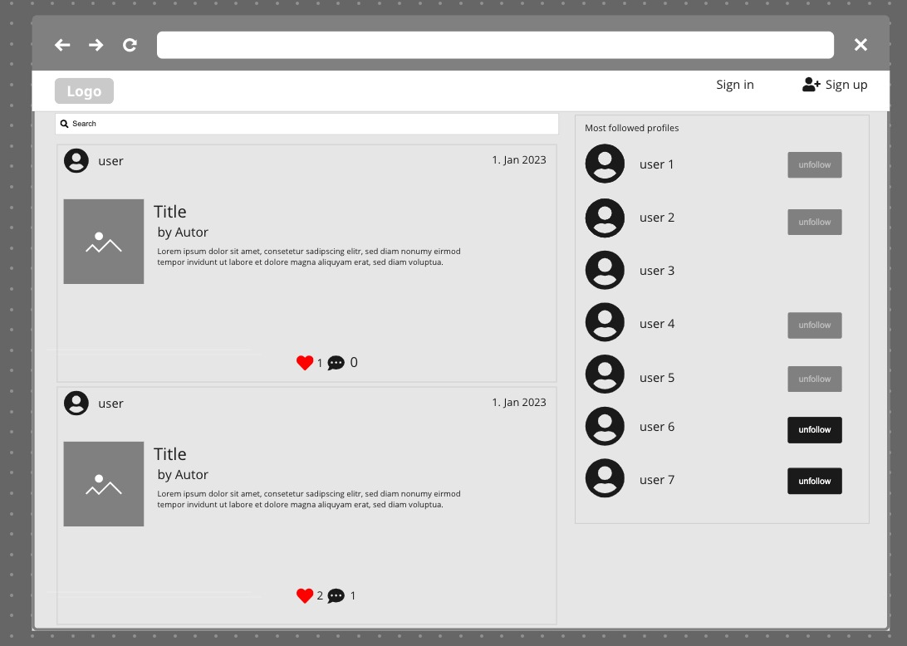
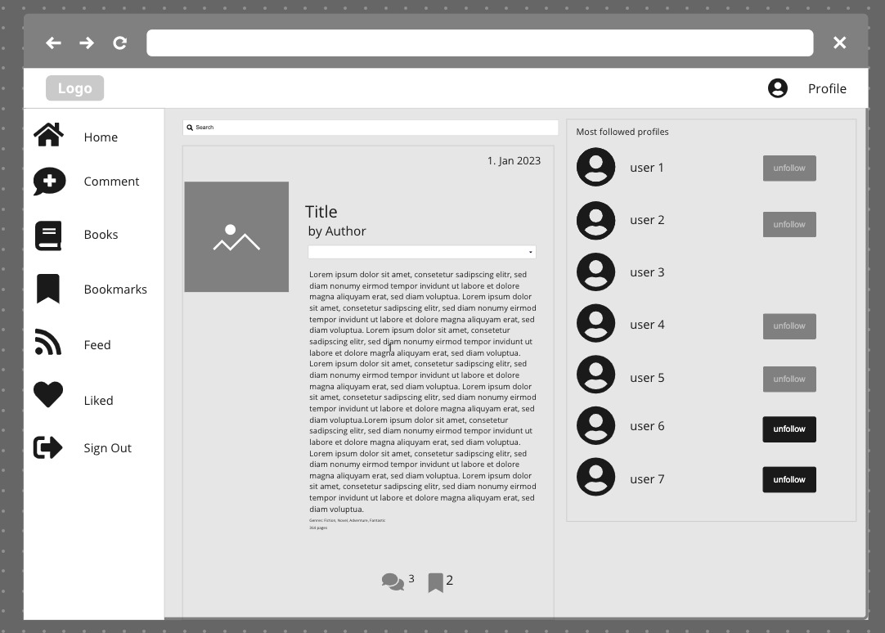
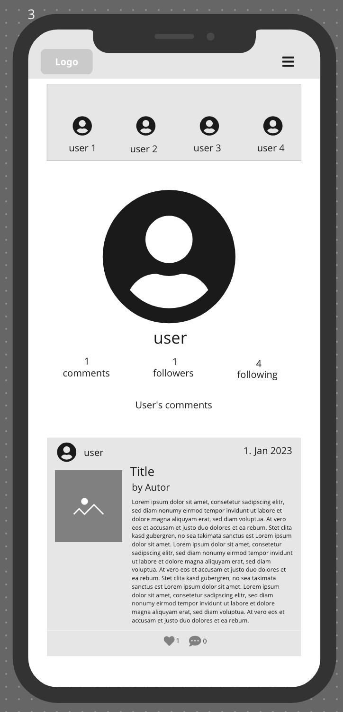
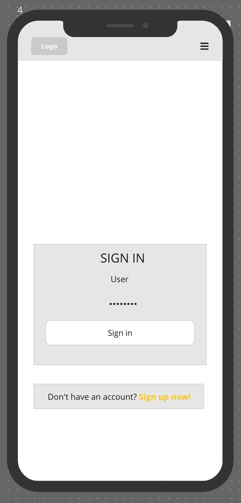
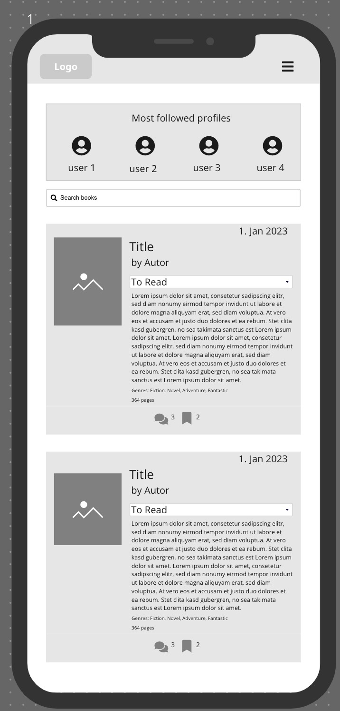
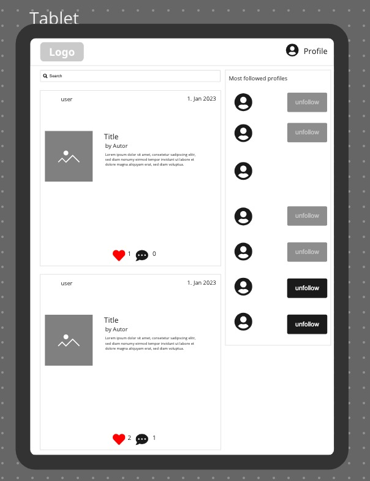

# **_The last book page - The social network for reading_**

# Objective

The aim of this application is to provide the possibility of commenting on book readings, hence the name: _the last book page_, as a call to socialise reading every time the last page of a book is closed, and also to organise future readings (hence the bookmarks).

# User Experience (UX)

### User Stories

In total 48 User Stories have been created and executed in 15 Epics (Milestones). In the backend 20 User Stories with 8 Epics, and in the Frontend 26 User Stories with 7 Epics (2 User Stories are pending).
Epic 11 was added in the backend while the frontend was being developed to add the option to insert stickers in comments and have the API provide that information. Search fields were sometimes added in the backend to meet the frontend's wishes for search and display information. In the commit history you can see how the tasks were executed as the development of the application progressed.

## Backend Django REST API

### Epic#1

[#1](https://github.com/patchamama/PP5-drf-api-The-last-book-page/issues/1) As a **Developer**, I can **create and develop the profiles app** so that **the users can create their own profiles**

[#2](https://github.com/patchamama/PP5-drf-api-The-last-book-page/issues/2) As a **Developer**, I can **serialize the profiles app** so that **the data can be used as python native datatype and can be render to JSON**

[#15](https://github.com/patchamama/PP5-drf-api-The-last-book-page/issues/15) As a **Developer**, I can **, I can install Django with its dependencies** so that ** can be created the project and apps to develop**

### Epic#2

[#13](https://github.com/patchamama/PP5-drf-api-The-last-book-page/issues/13) As a **Developer**, I can **Install and develop the books app** so that **users can create their own books**

[#14](https://github.com/patchamama/PP5-drf-api-The-last-book-page/issues/14) As a **Developer**, I can **serialize the books app** so that **the data can be used as python native datatype and can be render to JSON**

### Epic#3

[#3](https://github.com/patchamama/PP5-drf-api-The-last-book-page/issues/3) As a **Developer**, I can **Install and develop the comments app** so that **users can create their own comments**

[#4](https://github.com/patchamama/PP5-drf-api-The-last-book-page/issues/4) As a **Developer**, I can **serialize the comments app** so that **the data can be used as python native datatype and can be render to JSON**

[#5](https://github.com/patchamama/PP5-drf-api-The-last-book-page/issues/5) As a **Developer**, I can **develop the comment detail view** so that **the user can develop Read, Update, Delete and retrieve data of comments**

[#6](https://github.com/patchamama/PP5-drf-api-The-last-book-page/issues/6) As a **Developer**, I can **serialize the comments detail app** so that **the data can be used as python native datatype and can be render to JSON**

### Epic#4

[#7](https://github.com/patchamama/PP5-drf-api-The-last-book-page/issues/7) As a **Developer**, I can **Install and develop the likes app** so that **users can create their own likes**

[#8](https://github.com/patchamama/PP5-drf-api-The-last-book-page/issues/8) As a **Developer**, I can **serialize the likes app** so that **the data can be used as python native datatype and can be render to JSON**

### Epic#5

[#11](https://github.com/patchamama/PP5-drf-api-The-last-book-page/issues/11) As a **Developer**, I can **Install and develop the followers app** so that **users can create their own followers**

[#12](https://github.com/patchamama/PP5-drf-api-The-last-book-page/issues/12) As a **Developer**, I can **serialize the followers app** so that **the data can be used as python native datatype and can be render to JSON**

### Epic#6

[#9](https://github.com/patchamama/PP5-drf-api-The-last-book-page/issues/9) As a **Developer**, I can **Install and develop the bookmarks app** so that **users can create their own bookmarks**

[#10](https://github.com/patchamama/PP5-drf-api-The-last-book-page/issues/10) As a **Developer**, I can **serialize the bookmarks app** so that **the data can be used as python native datatype and can be render to JSON**

### Epic#7

[#16](https://github.com/patchamama/PP5-drf-api-The-last-book-page/issues/16) As a **Developer**, I can **optimize, document and fix bugs** so that **users can use the API with the expected functionalities**

[#17](https://github.com/patchamama/PP5-drf-api-The-last-book-page/issues/17) As a **Developer**, I can **create filters** so that **users can access as much useful data as the API can provide**

[#19](https://github.com/patchamama/PP5-drf-api-The-last-book-page/issues/19) As a **Developer**, I can **program tests to evaluate the behaviour of the api** so that **users can get the expected functionalities**

### Epic#11

[#36](https://github.com/patchamama/PP5-drf-api-The-last-book-page/issues/36) - As a **Developer**, I can **Install and develop the stickers app** so that **users can add notes to comments of books**

[#37](https://github.com/patchamama/PP5-drf-api-The-last-book-page/issues/37) As a **Developer**, I can **serialize the stickers app** so that **the data can be used as python native datatype and can be render to JSON**

## Frontend React

### Epic#8

[#20](https://github.com/patchamama/PP5-drf-api-The-last-book-page/issues/20) As a **User**, I can **register an account** so that **, I can access to the features available to registered users**

[#21](https://github.com/patchamama/PP5-drf-api-The-last-book-page/issues/21) As a **User**, I can **access to a navigation bar on every page** so that **, I can easily view and access to desired content**

[#22](https://github.com/patchamama/PP5-drf-api-The-last-book-page/issues/22) As a **User**, I can **register for an account** so that **, I can access to information dedicated to registered users**

[#23](https://github.com/patchamama/PP5-drf-api-The-last-book-page/issues/23) As a **User**, I can **log out** so that **, I can safely disconnect from the site**

[#24](https://github.com/patchamama/PP5-drf-api-The-last-book-page/issues/24) As a **logged-in User**, I can **see my login status** so that **I know my status of logged in or logged out of my account**

### Epic#9

[#27](https://github.com/patchamama/PP5-drf-api-The-last-book-page/issues/27) As a **User**, I can **view the complete comments** so that **, I can access and read the comments of the app**

[#28](https://github.com/patchamama/PP5-drf-api-The-last-book-page/issues/28) As a **logged-in User**, I can **create comments** so that **, I can add content to the website**

[#31](https://github.com/patchamama/PP5-drf-api-The-last-book-page/issues/31) As a **logged-in User**, I can **like a comment** so that **, I can show my approval and interest in the commentary**

[#32](https://github.com/patchamama/PP5-drf-api-The-last-book-page/issues/32) As a **User**, I can **see the newest comments at the top** so that **I am up to date with the latest content**

### Epic#10

[#29](https://github.com/patchamama/PP5-drf-api-The-last-book-page/issues/29) As a **logged-in User**, I can **edit my comments** so that **, I can update and do corrections of my contents added**

[#30](https://github.com/patchamama/PP5-drf-api-The-last-book-page/issues/30) As a **logged-in User**, I can **delete my comments** so that **, I can remove any comment that I don't want to share more**

[#33](https://github.com/patchamama/PP5-drf-api-The-last-book-page/issues/33) As a **User**, I can **keep scrolling through the images that are loaded automatically** so that **I visit all the browse easy all the content**

[#34](https://github.com/patchamama/PP5-drf-api-The-last-book-page/issues/34) As User**, I can **search the content easily** so that **, I can find with simplicity any wished information\*\*

### Epic#12

[#38](https://github.com/patchamama/PP5-drf-api-The-last-book-page/issues/38) As a **User**, I can **view stickers on comments** so that **, I can read other user**

[#40](https://github.com/patchamama/PP5-drf-api-The-last-book-page/issues/40) As a **logged-in User and owner of the sticker**, I can **update my sticker** so that **, I can fix any error**

[#41](https://github.com/patchamama/PP5-drf-api-The-last-book-page/issues/41) As a **logged-in User and owner of the sticker**, I can **delete my sticker** so that **, I can remove any unwanted sticker from the site**

### Epic#13

[#42](https://github.com/patchamama/PP5-drf-api-The-last-book-page/issues/42) As a **User**, I can **view the profiles of other users** so that **, I can see their bio and learn more about them**

[#43](https://github.com/patchamama/PP5-drf-api-The-last-book-page/issues/43) As a **logged-in User**, I can **customise my profile with an avatar** so that **my profile can be easy to be identified within the site**

[#44](https://github.com/patchamama/PP5-drf-api-The-last-book-page/issues/44) As a **logged-in User**, I can **have the option to follow/unfollow users** so that **, I can keep track of their content**

### Epic#14

[#46](https://github.com/patchamama/PP5-drf-api-The-last-book-page/issues/46) As a **logged-in User**, I can **add new books** so that **, I can add comments about the book**

[#47](https://github.com/patchamama/PP5-drf-api-The-last-book-page/issues/47) As a **logged-in User**, I can **edit and update any book** so that **, I can fix or update the content of fields**

[#48](https://github.com/patchamama/PP5-drf-api-The-last-book-page/issues/48) As a **logged-in User**, I can **delete books that I have created** so that **, I can delete books duplicated or not desired**

### Epic#15

[#49](https://github.com/patchamama/PP5-drf-api-The-last-book-page/issues/49) As a **logged-in User**, I can **delete books that I have created** so that **, I can delete books duplicated or not desired**

[#50](https://github.com/patchamama/PP5-drf-api-The-last-book-page/issues/50) As a **Logged-in User**, I can **view the list of my bookmarks,** so that **, I can to see the books to check and review**

[#51](https://github.com/patchamama/PP5-drf-api-The-last-book-page/issues/51) As a **logged-in User**, I can **edit and change any bookmark** so that **, I can change the status of the book in my bookmark**

[#52](https://github.com/patchamama/PP5-drf-api-The-last-book-page/issues/52) As a **logged-in User**, I can **remove a bookmark** so that **, I can remove bookmarks of book not desired**

## Pending

[#53](https://github.com/patchamama/PP5-drf-api-The-last-book-page/issues/53) As **logged-in User**, I can **send message to any other user,** so that **I can do any communication about books comments, readings...**

[#54](https://github.com/patchamama/PP5-drf-api-The-last-book-page/issues/54) As **logged-in User**, I can **read messages from any user,** so that **, I can be informed about any communication received**

### Design

For the design of the site we have opted for simplicity and few colours to achieve good visibility of the content with good contrast.

#### Wireframes

Wireframes have been generated to guide the design and development process to achieve the desired functionality. For the creation of the wireframes [miro](https://miro.com) has been used.

### Desktop

 
Homepage <i>logged out</i>

 
Homepage / Feed / Liked structure web <i>logged in</i>

 
Create comment

 
Book and Bookmarks structure

### Mobile

 
Homepage / Feed / Liked structure web <i>logged in</i>

 
Homepage <i>sign in</i>

 
Homepage <i>sign up</i>

 
Book and Bookmarks structure

### Tablet

 
Book and Bookmarks structure

#### Colour Scheme

Colours have been chosen to provide good contrast to allow good access to and viewing of the content. The aim is to create a positive user experience for all visitors to the site.

_Colour palette from_ [_Coolors_](https://coolors.co/)

### Images

The images used on the site relate to the context in which they are shown or to books and libraries. Images are taken from [Pexels](https://www.pexels.com/)

### Tipografy
