# **_The last book page - The social network for reading_**

The live link can be found [**here**]()

To view the README of the backend _API repository_, please click [**here**](README-backend.md)

# Objective

The aim of this application is to provide the possibility of commenting on book readings, hence the name: _the last book page_, as a call to socialise reading every time the last page of a book is closed, and also to organise future readings (hence the bookmarks).

# User Experience (UX)

### User Stories

In total 48 User Stories have been created and executed in 15 Epics (Milestones). In the backend 20 User Stories with 8 Epics, and in the Frontend 26 User Stories with 7 Epics (2 User Stories are pending).
Epic 11 was added in the backend while the frontend was being developed to add the option to insert stickers in comments and have the API provide that information. Search fields were sometimes added in the backend to meet the frontend's wishes for search and display information. In the commit history you can see how the tasks were executed as the development of the application progressed.

## Backend Django REST API

### Epic#1

[#1](https://github.com/patchamama/PP5-drf-api-The-last-book-page/issues/1) As a **Developer**, I can **create and develop the profiles app** so that **the users can create their own profiles**

[#2](https://github.com/patchamama/PP5-drf-api-The-last-book-page/issues/2) As a **Developer**, I can **serialize the profiles app** so that **the data can be used as python native datatype and can be render to JSON**

[#15](https://github.com/patchamama/PP5-drf-api-The-last-book-page/issues/15) As a **Developer**, I can **, I can install Django with its dependencies** so that ** can be created the project and apps to develop**

### Epic#2

[#13](https://github.com/patchamama/PP5-drf-api-The-last-book-page/issues/13) As a **Developer**, I can **Install and develop the books app** so that **users can create their own books**

[#14](https://github.com/patchamama/PP5-drf-api-The-last-book-page/issues/14) As a **Developer**, I can **serialize the books app** so that **the data can be used as python native datatype and can be render to JSON**

### Epic#3

[#3](https://github.com/patchamama/PP5-drf-api-The-last-book-page/issues/3) As a **Developer**, I can **Install and develop the comments app** so that **users can create their own comments**

[#4](https://github.com/patchamama/PP5-drf-api-The-last-book-page/issues/4) As a **Developer**, I can **serialize the comments app** so that **the data can be used as python native datatype and can be render to JSON**

[#5](https://github.com/patchamama/PP5-drf-api-The-last-book-page/issues/5) As a **Developer**, I can **develop the comment detail view** so that **the user can develop Read, Update, Delete and retrieve data of comments**

[#6](https://github.com/patchamama/PP5-drf-api-The-last-book-page/issues/6) As a **Developer**, I can **serialize the comments detail app** so that **the data can be used as python native datatype and can be render to JSON**

### Epic#4

[#7](https://github.com/patchamama/PP5-drf-api-The-last-book-page/issues/7) As a **Developer**, I can **Install and develop the likes app** so that **users can create their own likes**

[#8](https://github.com/patchamama/PP5-drf-api-The-last-book-page/issues/8) As a **Developer**, I can **serialize the likes app** so that **the data can be used as python native datatype and can be render to JSON**

### Epic#5

[#11](https://github.com/patchamama/PP5-drf-api-The-last-book-page/issues/11) As a **Developer**, I can **Install and develop the followers app** so that **users can create their own followers**

[#12](https://github.com/patchamama/PP5-drf-api-The-last-book-page/issues/12) As a **Developer**, I can **serialize the followers app** so that **the data can be used as python native datatype and can be render to JSON**

### Epic#6

[#9](https://github.com/patchamama/PP5-drf-api-The-last-book-page/issues/9) As a **Developer**, I can **Install and develop the bookmarks app** so that **users can create their own bookmarks**

[#10](https://github.com/patchamama/PP5-drf-api-The-last-book-page/issues/10) As a **Developer**, I can **serialize the bookmarks app** so that **the data can be used as python native datatype and can be render to JSON**

### Epic#7

[#16](https://github.com/patchamama/PP5-drf-api-The-last-book-page/issues/16) As a **Developer**, I can **optimize, document and fix bugs** so that **users can use the API with the expected functionalities**

[#17](https://github.com/patchamama/PP5-drf-api-The-last-book-page/issues/17) As a **Developer**, I can **create filters** so that **users can access as much useful data as the API can provide**

[#19](https://github.com/patchamama/PP5-drf-api-The-last-book-page/issues/19) As a **Developer**, I can **program tests to evaluate the behaviour of the api** so that **users can get the expected functionalities**

### Epic#11

[#36](https://github.com/patchamama/PP5-drf-api-The-last-book-page/issues/36) - As a **Developer**, I can **Install and develop the stickers app** so that **users can add notes to comments of books**

[#37](https://github.com/patchamama/PP5-drf-api-The-last-book-page/issues/37) As a **Developer**, I can **serialize the stickers app** so that **the data can be used as python native datatype and can be render to JSON**

## Frontend React

### Epic#8

[#20](https://github.com/patchamama/PP5-drf-api-The-last-book-page/issues/20) As a **User**, I can **register an account** so that **, I can access to the features available to registered users**

[#21](https://github.com/patchamama/PP5-drf-api-The-last-book-page/issues/21) As a **User**, I can **access to a navigation bar on every page** so that **, I can easily view and access to desired content**

[#22](https://github.com/patchamama/PP5-drf-api-The-last-book-page/issues/22) As a **User**, I can **register for an account** so that **, I can access to information dedicated to registered users**

[#23](https://github.com/patchamama/PP5-drf-api-The-last-book-page/issues/23) As a **User**, I can **log out** so that **, I can safely disconnect from the site**

[#24](https://github.com/patchamama/PP5-drf-api-The-last-book-page/issues/24) As a **logged-in User**, I can **see my login status** so that **I know my status of logged in or logged out of my account**

### Epic#9

[#27](https://github.com/patchamama/PP5-drf-api-The-last-book-page/issues/27) As a **User**, I can **view the complete comments** so that **, I can access and read the comments of the app**

[#28](https://github.com/patchamama/PP5-drf-api-The-last-book-page/issues/28) As a **logged-in User**, I can **create comments** so that **, I can add content to the website**

[#31](https://github.com/patchamama/PP5-drf-api-The-last-book-page/issues/31) As a **logged-in User**, I can **like a comment** so that **, I can show my approval and interest in the commentary**

[#32](https://github.com/patchamama/PP5-drf-api-The-last-book-page/issues/32) As a **User**, I can **see the newest comments at the top** so that **I am up to date with the latest content**

### Epic#10

[#29](https://github.com/patchamama/PP5-drf-api-The-last-book-page/issues/29) As a **logged-in User**, I can **edit my comments** so that **, I can update and do corrections of my contents added**

[#30](https://github.com/patchamama/PP5-drf-api-The-last-book-page/issues/30) As a **logged-in User**, I can **delete my comments** so that **, I can remove any comment that I don't want to share more**

[#33](https://github.com/patchamama/PP5-drf-api-The-last-book-page/issues/33) As a **User**, I can **keep scrolling through the images that are loaded automatically** so that **I visit all the browse easy all the content**

[#34](https://github.com/patchamama/PP5-drf-api-The-last-book-page/issues/34) As User**, I can **search the content easily** so that **, I can find with simplicity any wished information\*\*

### Epic#12

[#38](https://github.com/patchamama/PP5-drf-api-The-last-book-page/issues/38) As a **User**, I can **view stickers on comments** so that **, I can read other user**

[#40](https://github.com/patchamama/PP5-drf-api-The-last-book-page/issues/40) As a **logged-in User and owner of the sticker**, I can **update my sticker** so that **, I can fix any error**

[#41](https://github.com/patchamama/PP5-drf-api-The-last-book-page/issues/41) As a **logged-in User and owner of the sticker**, I can **delete my sticker** so that **, I can remove any unwanted sticker from the site**

### Epic#13

[#42](https://github.com/patchamama/PP5-drf-api-The-last-book-page/issues/42) As a **User**, I can **view the profiles of other users** so that **, I can see their bio and learn more about them**

[#43](https://github.com/patchamama/PP5-drf-api-The-last-book-page/issues/43) As a **logged-in User**, I can **customise my profile with an avatar** so that **my profile can be easy to be identified within the site**

[#44](https://github.com/patchamama/PP5-drf-api-The-last-book-page/issues/44) As a **logged-in User**, I can **have the option to follow/unfollow users** so that **, I can keep track of their content**

### Epic#14

[#46](https://github.com/patchamama/PP5-drf-api-The-last-book-page/issues/46) As a **logged-in User**, I can **add new books** so that **, I can add comments about the book**

[#47](https://github.com/patchamama/PP5-drf-api-The-last-book-page/issues/47) As a **logged-in User**, I can **edit and update any book** so that **, I can fix or update the content of fields**

[#48](https://github.com/patchamama/PP5-drf-api-The-last-book-page/issues/48) As a **logged-in User**, I can **delete books that I have created** so that **, I can delete books duplicated or not desired**

### Epic#15

[#49](https://github.com/patchamama/PP5-drf-api-The-last-book-page/issues/49) As a **logged-in User**, I can **delete books that I have created** so that **, I can delete books duplicated or not desired**

[#50](https://github.com/patchamama/PP5-drf-api-The-last-book-page/issues/50) As a **Logged-in User**, I can **view the list of my bookmarks,** so that **, I can to see the books to check and review**

[#51](https://github.com/patchamama/PP5-drf-api-The-last-book-page/issues/51) As a **logged-in User**, I can **edit and change any bookmark** so that **, I can change the status of the book in my bookmark**

[#52](https://github.com/patchamama/PP5-drf-api-The-last-book-page/issues/52) As a **logged-in User**, I can **remove a bookmark** so that **, I can remove bookmarks of book not desired**

## Pending

[#53](https://github.com/patchamama/PP5-drf-api-The-last-book-page/issues/53) As **logged-in User**, I can **send message to any other user,** so that **I can do any communication about books comments, readings...**

[#54](https://github.com/patchamama/PP5-drf-api-The-last-book-page/issues/54) As **logged-in User**, I can **read messages from any user,** so that **, I can be informed about any communication received**

### Design

For the design of the site we have opted for simplicity and few colours to achieve good visibility of the content with good contrast.

#### Wireframes

Wireframes have been generated to guide the design and development process to achieve the desired functionality. For the creation of the wireframes [miro](https://miro.com) has been used.

### Desktop

 
Homepage <i>logged out</i>

 
Homepage = comments / Feed / Liked structure web <i>logged in</i>

 
Create comment

 
Book / Bookmarks structure

### Mobile

 
Homepage <i>sign in</i>

 
Homepage <i>sign up</i>

 
Homepage / Feed / Liked structure web <i>logged in</i>

 
Book / Bookmarks structure

#### Colour Scheme

Colours have been chosen to provide good contrast to allow good access to and viewing of the content. The aim is to create a positive user experience for all visitors to the site.

_Colour palette from_ [_Coolors_](https://coolors.co/)

### Images

The images used on the site relate to the context in which they are shown or to books and libraries. Images are taken from [Pexels](https://www.pexels.com/)

### Tipografy

As font, was selected Roboto, intending to create an elegant and calming visual theme, while ensuring easy readability and consistency across multiple devices. In case there are any issues with the primary font choices, a reliable backup font, Sans-serif, has been selected to ensure consistent styling throughout the app.

# Agile Methodology

For the management of the development of the application, an agile approach was used and for this purpose a kanban board was used as you can see in the [link](https://github.com/users/patchamama/projects/8/views/1).

A GitHub Issue was created for each User Story, which was then allocated to a milestone (Epic). Each User Story has defined acceptance criteria to make it clear when the User Story has been completed. The acceptance criteria are further broken down into tasks to facilitate the User Story's execution. The issues were closed automatically when the pull request was linked to the issue, most of them were closed automatically but some were closed manually.

## Security Features and Defensive Design

### Form Validation

A warning message will appear to the user when inaccurate or empty data is entered into a form, identifying the specific field that caused the issue. This prevents the form from being submitted until the issue is resolved, ensuring that only accurate and complete data is processed.

## Features

### Header

**Logo**

- A customised logo was created using [Logo.com](https://logo.com/) which is a free logo generator.

- The logo is prominently positioned in the top-left corner of the navigation bar. It is linked to the homepage to make it easy for users to navigate back to the main page of the website.

**Navigation Bar**

- The navigation bar is present on all pages of the website and allows for easy navigation. The Navbar includes a logo and links to various pages. The links on the Navbar will change depending on whether the user is logged into their account or not.

#### _User has not logged in Navbar_

- The information icon is visible at all times, and when the user hovers over it, a tooltip displays the word 'Information', providing a clear and concise way for users to access additional information.

#### _User logged-in Navbar_

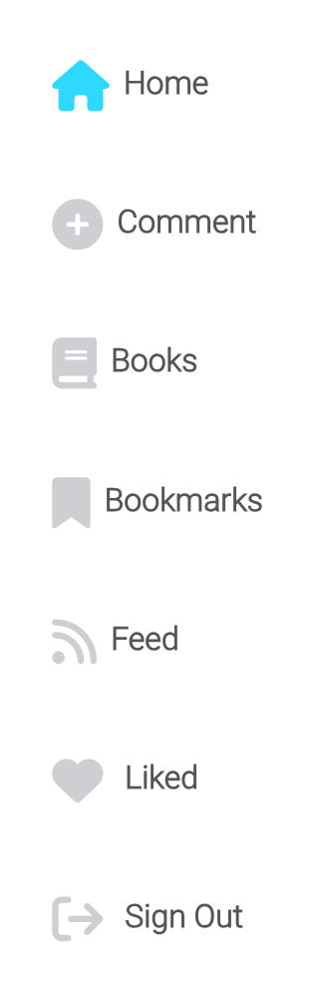

- If a user is logged in, their profile avatar will be displayed in the navigation bar and also a side navigation menu will appear. This menu provides a logged-in user with the ability to manage and save comments, books and sign out of their account.

### Home Page

- The homepage offers a variety of features for both logged-in and logged-out users, including the search functionality which allows users to search for comments and profiles. To improve the user experience, a loading spinner appears while the user is typing their search query. If no search results are found, an image accompanied by the text 'No results found' is displayed to help users quickly understand the outcome of their search.

**Search Functionality**

### User Account Pages

- The authentication pages are based on the _'moments walkthrough'_ provided by Code Institute, with minor adjustments made to suit the needs of my project. The authentication process works seamlessly and meets the requirements I had in mind for my project.

**Sign Up**

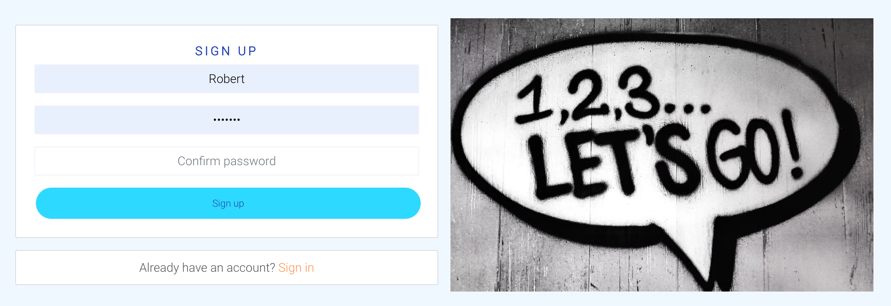

**Sign In**

**Sign Out**

- When the user clicks on the sign-out tab in the side navigation bar, a pop-up sign-out modal appears, providing users with a clear confirmation option to sign out of their account. This feature ensures a smooth and secure user experience, enhancing the usability of the application.

### Comment Detail Page

**Comment Action Buttons**

- On the comment detail page, if the logged-in user is the owner of the comment, they will have the option to edit or delete the comment by the presence of a menu which consists of an edit and delete icon.

### Edit Comment

- Clicking on the edit icon for a comment will display the comment with the prepopulated data, allowing users to easily make edits and updates to their content.

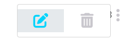

### Add Comment

- Users can easily add new comment by accessing the 'Add comment' tab located in the side navigation bar, providing a simple and streamlined way to create content.

### Delete Comment

- By clicking on the delete icon in the Comment Edit dropdown menu, users can easily remove their comments from the database.

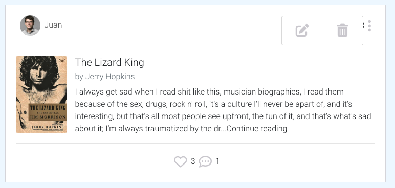

**Stickers Section**

- The stickers section on a comment detail page is accessible to both logged-in and logged-out users. However, to create a sticker, users must be signed in, as the sticker input field is only displayed to authenticated users. This ensures a secure and efficient adding of stickers process for users.

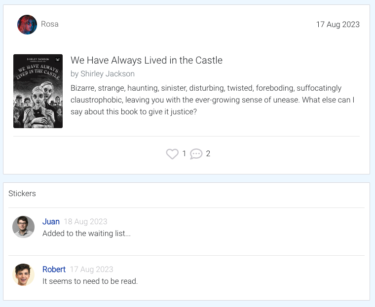

### Update Sticker

- The process of updating a sticker has been made even more user-friendly through the implementation of the Comment dropdown menu component. This feature provides users with the ability to easily update or delete their stickers. By clicking on the edit icon, the sticker data is automatically prepopulated, making the editing process seamless and efficient.

### Delete Sticker

### My Feed Page

- A user's feed will compose of comments which the user is following. The feed page has the same styling as Home and Liked as it uses the Comment component. The Infinite scroll component is used to continuously display comments, allowing the user to not have to change pages to view more comments.

### My Bookmarks Page

- The Bookmarks page displays a user's collection of bookmarked books, easily identified by a bookmark icon on the comment component. By simply selecting the bookmark option, a comment can be saved to the user's personal Bookmarks page. The bookmark page has the same styling as Book as it uses the Book component.

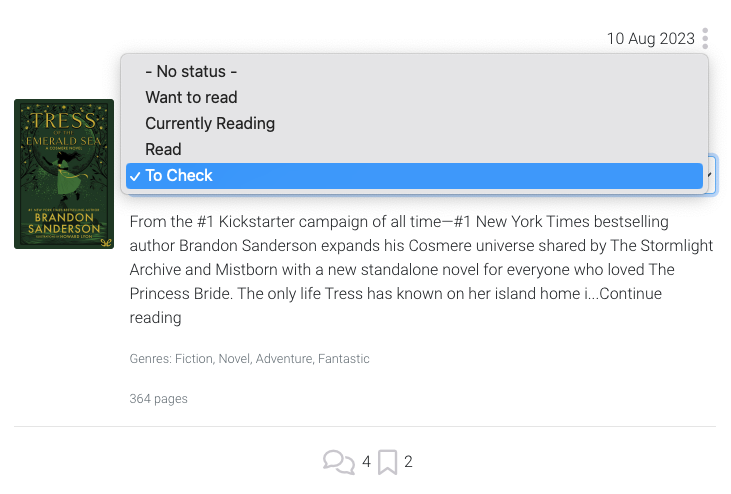

### Profile Page

- The user profile page features an avatar image, along with the total number of comments, followers, and the following count. This functionality has been thoroughly tested to ensure that the counts accurately increment and decrement in response to various user actions, such as following a user or adding a new comment.

### Edit Profile

- For an improved user experience, the edit profile page comes with prepopulated data, making it easier for users to quickly update their profile information without having to re-enter existing data.

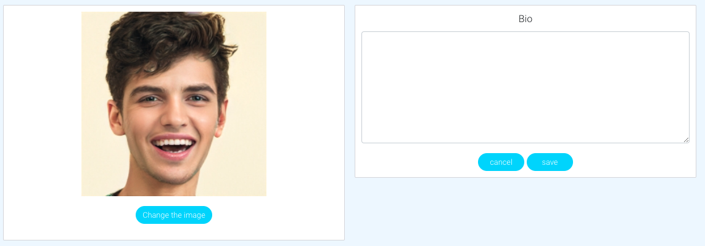

### Change Username

- For an improved user experience, the change username functionality comes prepopulated with the user's current username.

### Change password

- To enhance the security of users' accounts, the application provides an option for users to change their password, giving them greater control over the protection of their personal information.

### Error Page

- A simple 404 error page has been implemented to improve the user experience in cases where the user enters an incorrect URL. This page provides a clear and user-friendly message, guiding the user back to the website's homepage and helping them find the information they are looking for.

### Notifications

- React notifications have been used in the app to enhance the user experience by providing real-time feedback and alerts to the user. This has contributed to a better user experience as users are immediately notified of any changes or actions taken within the app, such as successful logins, errors or notifications for removing content. By providing these notifications, users can stay informed and engaged with the app, leading to a smoother and more seamless experience. Additionally, the use of notifications also adds an element of interactivity and visual appeal to the app, making it more engaging and dynamic for users.

---

### Future Features

In the future, there are several functionalities that I would like to implement. I have left the initial user stories that were created in the project kanban board as potential areas for future improvement and these have been left in the [Future Features](https://github.com/users/patchamama/projects/8/views/1) section of the kanban board. The key areas I would like to add to the site include:

- [#53](https://github.com/patchamama/PP5-drf-api-The-last-book-page/issues/53) As **logged-in User**, I can **send message to any other user,** so that **I can do any communication about books comments, readings...**

- [#54](https://github.com/patchamama/PP5-drf-api-The-last-book-page/issues/54) As **logged-in User**, I can **read messages from any user,** so that **, I can be informed about any communication received**

It could also be interesting to add the option of rating books.

## Some reusable components

### `Asset.js`

_Asset.js_ is a versatile and reusable component that is used throughout my app to display a loading spinner in a visually appealing way. With customizable props such as spinner, src, and message, the component can be easily adapted to suit different use cases and design requirements. When the spinner prop is set to true, the component displays a rotating Earth animation to indicate that content is being loaded. When the src prop is present, the component displays an image with customizable alt text provided by the message prop. When the message prop is present, the component displays a paragraph of text below the image.

### `Avatar.js`

The _Avatar.js_ component is designed to display user avatars with a high degree of flexibility and reusability. Separating the avatar display from other components and pages enables more efficient code organization and easier maintenance. With customizable height and an optional text overlay, the Avatar component can adapt to different page designs and layouts, allowing for seamless integration into different parts of the site. Additionally, by including a timestamp in the image source, the Avatar component ensures that the image is always up-to-date and reloaded from the server when necessary. This feature helps prevent the browser from caching outdated images and ultimately contributes to improved site performance.

### `MoreDropdown.js`

_MoreDropdown.js_ is a reusable component that renders a dropdown bar with edit and delete options. It is built using React and React Bootstrap components and styled using CSS. The component consists of a custom DropdownMenu component that renders a menu icon _(fas fa-ellipsis-v)_, and a Bootstrap Dropdown component that contains the dropdown menu items. The menu items include an Edit option and a Delete option, each with an associated icon. The component is designed to be flexible and customizable, allowing it to easily integrate elsewhere and modify its behaviour and appearance as needed. This component is being used within `Comment.js`, `Book.js` and `Sticker.js` to allow users to edit and delete elements.

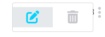

### React Infinite Scroll component

React Infinite Scroll is used to load content continuously as the user scrolls down a webpage. This feature works by loading new content into the webpage when the user reaches the bottom of the page, without requiring the user to manually click a _Load More_ button. In the app, the React Infinite Scroll feature is being used to display a list of comments, books, and bookmarks. When a user scrolls down the page, the application automatically loads new comments, books, and bookmarks from the server and displays them in the list. This means that the user can continue scrolling indefinitely and the application will keep loading new content as needed, without requiring the user to refresh the page or click a button to load more content. This feature provides a seamless user experience, as the user can easily browse through a large amount of content without interruptions or delays.

## Hooks

### `useClickOutsideToggle.js`

This custom hook allows you to toggle a component's state based on clicks outside of it. It is useful for things like menus or popovers that need to be dismissed when the user clicks outside of them. I am using this hook in my `NavBar.js` component to automatically close the Navbar.Toggle Bootstrap component for small screen sizes. When the user clicks on the menu, it toggles the expanded state using the setExpanded function. The expanded value is then used to conditionally render the menu items. When the user clicks outside of the menu, the `useClickOutsideToggle` hook automatically updates the expanded state to false, hiding the menu.

### `useRedirect.js`

The useRedirect hook is a custom React hook that uses the React Router and Axios libraries to handle navigation and API requests. Its primary function is to redirect the user based on their authentication status, ensuring that they are directed to the appropriate page based on whether they are logged in or out. When called, the hook sends a POST request to refresh the authentication token using the Axios library. If the user is logged in, they will be redirected to the home page using the useHistory hook from the React Router library. If there is an error refreshing the token or the user is logged out, they will also be redirected to the home page. This hook streamlines navigation in my React app and simplifies the logic for handling authentication.

## Languages Used

>)

## Programs, Frameworks & Libraries Used

### Programs

[**Miro**](https://miro.com/) - Miro was used to create the basic wireframes during the design process.

[**Google DevTools**](https://developer.chrome.com/docs/devtools/) - Once the website was made to a basic deployment level, Google DevTools was used frequently

[**Git**](https://git-scm.com/) - Git was used for version control by utilizing the Gitpod terminal to commit to Git and Push to GitHub.

[**GitHub**](https://github.com/) - GitHub is used to store the project's code after being pushed from Git.

[**Heroku**](http://heroku.com/) - Heroku is a cloud platform that lets people build, deliver, monitor, and scale apps. It supports several programming languages. Heroku was used for the deployment of this project.

[**W3C Markup Validator**](https://validator.w3.org/) -

[**JSHint Validator**](https://jshint.com/) - Jshint was used to validate the JavaScript code. It shows any warnings and errors within my code.

[**Cloudinary**](https://imgpile.com/) - A cloud-hosting website, used for hosting my images.

### Frameworks

[**ReactJS**](https://react.dev/) - React allows you to build user interfaces out of individual pieces called components. React components are JavaScript functions.
[**React Bootstrap**](https://react-bootstrap-v4.netlify.app/) - It was used as a supportive toolkit for front-end styling.

### Libraries & NPM packages

[**React Bootstrap 4.6**](https://react-bootstrap-v4.netlify.app/) - React Bootstrap provides a popular framework for building responsive mobile-first sites with built-in CSS & Javascript libraries.

[**axios**](https://axios-http.com/docs/intro) - Axios is a promise-based HTTP Client for node.js and the browser.

[**jwt-decode**](https://jwt.io/) - Securely implement authentication with JSON Web Tokens.

[**react-datepicker**](https://www.npmjs.com/package/react-datepicker) - A simple and reusable Datepicker component used for my date of birth field in a profile.

[**react-dom**](https://legacy.reactjs.org/docs/react-dom.html) - React library for rendering components in the DOM.

[**react-infinite-scroll-component**](https://www.npmjs.com/package/react-infinite-scroll-component) - React component for implementing infinite scrolling.

[**react-notifications**](https://www.npmjs.com/package/react-notifications) - Library for displaying notifications.

[**react-router-dom**](https://www.npmjs.com/package/react-router-dom) - React Router is a JavaScript framework that enables the creation of single-page web or mobile apps that allows navigating without refreshing the page.

[**web-vitals**](https://www.npmjs.com/package/web-vitals) - Library for measuring web performance metrics.

# Testing

Testing and results can be found [here](/TESTING.md)

# Development

This site was made using [GitHub](#github) & [Gitpod](https://www.gitpod.io/). The site was further developed using [React](#react), a JavaScript front-end framework.

# Deployment

## Using Heroku to deploy the project

- Setup of the local workspace:
  - This project was developed with the use of [pipenv](https://pypi.org/project/pipenv/) to handle all dependencies
  - Managing a `requirements.txt` file can be problematic, so Pipenv uses the upcoming `Pipfile` and `Pipfile.lock` instead, which is superior for basic use cases.
  - Create a `Procfile` in the local workspace and type in `web: gunicorn <name app>.wsgi:application` inside the file.
  - Commit and push to GitHub

This project was deployed using [Heroku](https://dashboard.heroku.com/) using the following steps:

1. Click on _New_ in the top-right corner and then _Create New App_.

2. On the next page give the app the unique name.
3. Choose a region (the USA or Europe).
4. Click _Create app_.

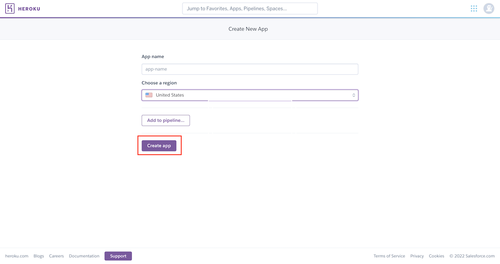

5. Go to the _Resources_ tab and search for PostgreSQL. Select _Hobby dev - Free_ and click on the provision button to add it to the project

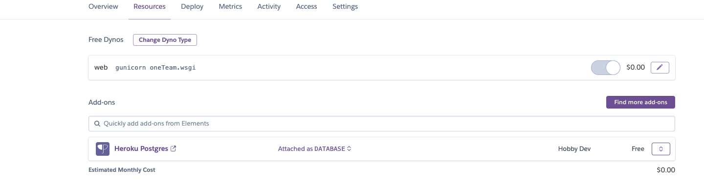

6. On the next page click on the _Settings_ tab.
7. In the Settings page open _Config Vars_ and add the following:

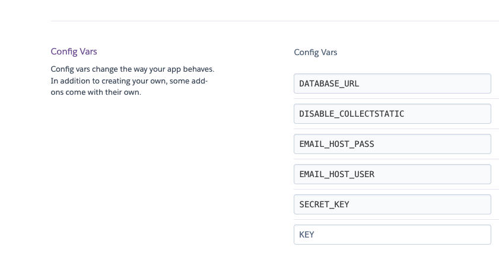

7. Copy the value of _DATABASE_URL_ and paste it into your `.env` file in your workspace together with your secret key.
8. Set `DEBUG = False` in `settings.py`.
9. Commit and push your changes to GitHub.
10. Click on the _Deploy_ tab.
11. In the _Deploy_ page in the _Deployment Method_ select GitHub.
12. After a successful connection to GitHub locate your repository and add it to Heroku.

13. In the _Manual Deploy_ section confirm that _main_ branch is selected and click _Deploy Branch_
14. For Final Deployment confirm `DEBUG = False` in `settings.py` and delete `DISABLE_COLLECTSTATIC` from _Config Vars_ in **Heroku**.
15. Commit and push changes to GitHub.

## Fork a repository

A fork is a copy of a repository. Forking a repository allows you to freely experiment with changes without affecting the original project. The steps are as follows:

1. On GitHub.com navigate to the repository page.
2. In the top-right corner of the page, click **Fork**.

You can fork a repository to create a copy of the repository and make changes without affecting the upstream repository.

## Clone a repository

In GitHub, you have the option to create a local copy (clone) of your repository on your device's hard drive. The steps are as follows:

1. On GitHub.com navigate to the repository page.
2. Locate the _Code_ tab and click on it.
3. In the expanded window, click the two squares icon to copy the HTTPS link of the repository.

4. On your computer, open **Terminal**.
5. Navigate to the directory of choice.
6. Type **git clone** and paste the copied link of the repository.
7. Press **Enter** and the local clone of the repository will be created in the selected directory.

# Credits

### Content

I have used a considerable amount of content throughout the site, inspired by the Code Institute's moments tutorial. However, I made several modifications to the project to customise it and make sure it met the requirements. While I kept certain aspects that worked well, I made sure to add my own unique touch to the project. Overall, I really enjoyed putting this project together.

- [React Bootstrap 4.6 docs](https://react-bootstrap-v4.netlify.app/)
- [React datepicker docs](https://www.npmjs.com/package/react-datepicker)
- [Code Institute - _'Moments'_ walkthrough project](https://github.com/Code-Institute-Solutions/moments)
- Deployment section is based on the owner's previous project [OneTeam](https://github.com/miloszmisiek/ci-pp4-one_team).
- Images of sing in and sing up: https://www.pexels.com/
- The logo was created by https://Logo.com

# Acknowledgments
